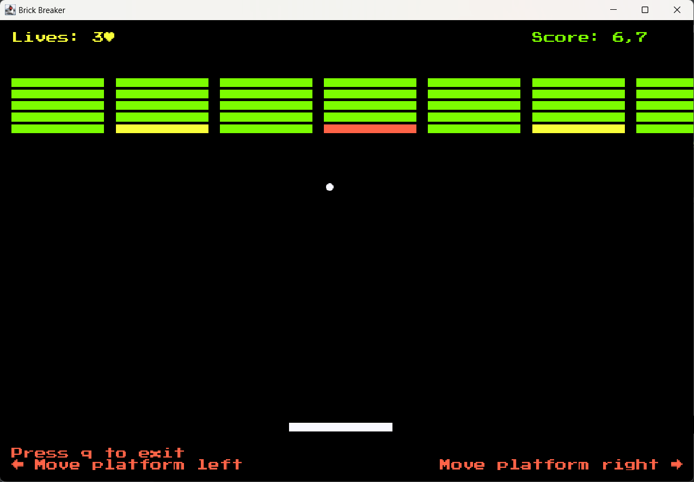
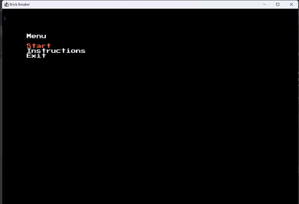

## LDTS_T09_G04 - BRICK BREAKER

Our game is the classic Brick Breaker game, launched at 1999.

Brick Breaker is a single player game that contains **bricks at the top of the screen** and a **small ball at the bottom of the screen supported on a platform**.
The player moves this platform left and right to bounce the ball to hit the bricks.
**The more bricks are smashed, the higher the game score**.
The game ends when there are no more bricks at the top or when the ball falls off the platform.

    

This project was developed by *Armando Martins* (*up201603566*@fe.up.pt), *Gonçalo Costa* (*up202103336*@fe.up.pt) and
*Leonor Filipe* (*up202204354*@edu.fe.up.pt) for LDTS 2022/2023.

[Full report](https://github.com/FEUP-LDTS-2022/project-l09gr04/tree/main/docs)

### PROJECT DEMO

    

