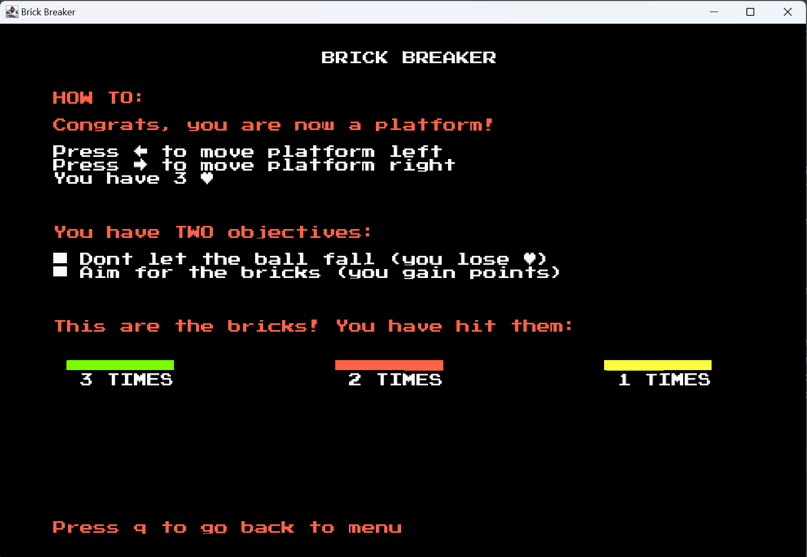

## LDTS_T09_G04 - BRICK BREAKER

Our game is the classic Brick Breaker game, launched in 1999.

Brick Breaker is a single player game that contains **bricks at the top of the screen** and a **small ball at the bottom
of the screen supported on a platform**.
The player moves this platform left and right to bounce the ball to hit the bricks.
**The more bricks are smashed, the higher the game score**. Additionally, every 5 points the platform gets an upgrade
in its size a limited number of times.
The game ends when there are no more bricks at the top or when the ball falls off the platform for the third time.
Every time the ball passes under the platform a life is lost. In this case, the ball restarts in the middle of the bar.

This project was developed by *Armando Martins* (*up201603566*@fe.up.pt), *Gonçalo Costa* (*up202103336*@fe.up.pt) and
*Leonor Filipe* (*up202204354*@edu.fe.up.pt) for LDTS 2022/2023.

### IMPLEMENTED FEATURES

#### **Menus**

    

On the main menu, the player can start playing the game, access the instructions, or exit the game.
The player has access to the main menu at any moment during the game by pressing 'q'.

    

Once on the instructions' menu, the player is able to go back to main menu by pressing 'q'.

#### **Bricks**
- **Bricks display**: bricks are displayed on top of the screen
- **Destruction control**: each brick has a number of hits until it is destroyed (3)
- **Collisions detection**: collisions between the ball and the bricks are verified
- **Brick destruction**: when a brick reaches the maximum number of hits (3), it is destroyed
- **Boosters**: every 5 gained points, a booster is obtained

    

#### **Booster**
A booster **is an increment in the size of the platform** and is gained every 5 gained points for a limited number of times.

#### **Platform**
- **Platform size adjustment**: the platform size control is done during the game while catching boosters
- **Platform size control**: once the platform reaches the pre-defined maximum platform size, it is not possible to size it up more
- **Platform speed**: the platform will have a speed for left and right movements
- **Platform control**: the platform moves with the keyboard control (left and right) and does not go further the wall

    

#### **Ball**
- **Ball bounce**: the ball bounces after hitting on a brick and on the platform
- **Random direction**: the ball has a random direction and changes according to the place where it hits on the platform

#### **Overall game**
- **Connected Menus**: the player has the capability of browsing through the different menus including in game ones (E.g.: Start, Instructions and Exit)
- **Buttons**: functional and interactive buttons, to change between menus and to play
- **Score display**: it is displayed on the screen the score that the player got so far
- **Score management**: every time the ball hits a brick, the player gains 1/3 of that brick's total points, dividing the total brick points to each hit until it is destroyed
  (and then the player receives the total brick points)
- **Constants**: includes global variables common to almost all classes of the project, avoiding duplicated code (E.g.: element sizes, colors,
  number of hits to destroy a brick, number of points to drop a booster, etc.)

### PLANNED FEATURES
- Creation of **different levels**, with different bricks display
- Addition of **more boosters** (E.g.: speed up the platform and/or the ball)

### ARCHITECTURAL PATTERN

#### **Problem in context**
While developing this game, we felt the need to divide the related program logic into three interconnected elements:
Model (storing all the elements of the game to be displayed on the screen), View (necessary to display on the screen
the elements of the Model) and Controller (essential to manage the interactions between the objects and the player inputs).

#### **Pattern**
We applied the MVC pattern, traditionally used for graphical user interfaces (GUIs) that we also developed,
in order to better organize and structure the code.

#### **Implementation**

    

    

#### **Consequences**
The MVC pattern allows the code to acknowledge the Single Responsibility Principle and also facilitates
the development of new features in the future, if necessary.
Beyond this, this pattern promotes presentation and data independence (i.e. multiple viewers on a model simultaneously),
the existence of switchable modes (by swapping one controller for another during runtime) and the
independence of input and output processing through separate controller and viewer responsibilities.

### DESIGN PATTERNS

### GAME STATES

#### **Problem in context**
Usually games present a menu with different options (game states), namely Start, Instructions and Quit.
Therefore, we needed to find an easy way to implement the various game states, but also make it flexible
to allow the addition of different states in the future, if necessary.

#### **Pattern**
We applied the State pattern, by creating classes for all states extending an abstract class State.
These states dictate the behaviour of the game.

#### **Implementation**

    

- Abstract class: State
- Classes that extend State: MenuState, GameState, InstructionsState

We can check the implementation of this pattern in our code in the following links:

- [State](https://github.com/leonor-f/LDTS_BrickBreaker/blob/master/src/main/java/com/aor/brickbreaker/states/State.java)
- [GameState](https://github.com/leonor-f/LDTS_BrickBreaker/blob/master/src/main/java/com/aor/brickbreaker/states/GameState.java)
- [MenuState](https://github.com/leonor-f/LDTS_BrickBreaker/blob/master/src/main/java/com/aor/brickbreaker/states/MenuState.java)
- [InstructionsState](https://github.com/leonor-f/LDTS_BrickBreaker/blob/master/src/main/java/com/aor/brickbreaker/states/InstructionsState.java)

#### **Consequences**
By implementing this pattern to our code, it became easier to read, and also to change it. Each state has
its class and its own implementation. So, if we want to change only one, using the Single Responsibility
Principle, or if we want to add a new state, we will not need to change any of the existing states.

### COMMON METHODS AND SIMILAR CLASSES

#### **Problem in context**
While doing this project, we had to create different objects with a lot in common,
leading to several methods with the same functions and tasks.

#### **Pattern**
Given this problem, we applied the Factory Method pattern, since it suggests that we
replace direct object constructions calls with calls to a special factory method.
Therefore, we were able to construct an abstract class that holds all common
methods shared by the related objects we were creating. This prevented the
creation of the same methods over and over again.

#### **Implementation**

    

- Abstract class: Element
- Classes that extend Element: Brick, Ball, Wall, Platform

We can check the implementation of this pattern in our code in the following links:

- [Element](https://github.com/leonor-f/LDTS_BrickBreaker/blob/master/src/main/java/com/aor/brickbreaker/model/game/elements/Element.java)
- [Ball](https://github.com/leonor-f/LDTS_BrickBreaker/blob/master/src/main/java/com/aor/brickbreaker/model/game/elements/Ball.java)
- [Brick](https://github.com/leonor-f/LDTS_BrickBreaker/blob/master/src/main/java/com/aor/brickbreaker/model/game/elements/Brick.java)
- [Platform](https://github.com/leonor-f/LDTS_BrickBreaker/blob/master/src/main/java/com/aor/brickbreaker/model/game/elements/Platform.java)
- [Wall](https://github.com/leonor-f/LDTS_BrickBreaker/blob/master/src/main/java/com/aor/brickbreaker/model/game/elements/Wall.java)

#### **Consequences**
Resulting from this pattern, when we create a new element, we are able to learn
about what methods we should implement and the main characteristics of any element,
maintaining coherence between all classes that correspond to an element.

### KNOWN CODE SMELLS AND REFACTORING SUGGESTIONS

#### **Long method**
Some methods, namely ArenaController.hitPlatform() and ArenaController.didHitBrick() are long
(15+ lines). In this case, we find it justifiable that the method is this long, since that is where
we are checking the hits between the ball and the other elements.
On the other hand, the long methods LanternaGUI.getNextAction() and InstructionsViewer.drawElements()
contain many if-elses/switch cases with all the possible actions or keyboard keys in the game. These
two methods could be minimized by applying the **Extract method**, in order to separate the if-elses/
switch cases into different new methods.

#### **Long class**
Some classes contain several methods and, therefore, are long (E.g.: LanternaGUI, with 208 lines).
We find this justifiable since the LanternaGUI class is responsible for displaying every object on screen,
requiring lots of methods.

#### **Dead code**
We realized that there are some getters and setters that are not used in the project.
However, we find that the remaining methods have a purpose and a contribution to the game.

#### **Switch statements**
We use switch cases to handle all the possible key actions: MenuController.step(), KeyBoardObserver.keyPressed().
These two methods could be simplified by applying the **Extract method**, in order to separate the switch cases
into different new methods, as mentioned before.

### TESTING

#### **COVERAGE REPORT**

    

#### **- Controller**

    

#### **- GUI**

    

#### **- Model**

    

#### **- States**

    

#### **- Viewer**

    

#### **MUTATION TESTING**

    

[PITEST](https://github.com/leonor-f/LDTS_BrickBreaker/tree/master/src/test/pitest/202212210942)

### SELF-EVALUATION

Our group worked well as we split the features of our project, resulting in
a connected project that worked and was fluent. When we got together, we grouped
the individual tasks on just one computer, correcting possible incompatibilities.
This way, the commits are not the same for everyone, despite all the elements of
the group having given their contribution to the project.

- Leonor Filipe: 33.3
- Armando Martins: 33.3
- Gonçalo Costa: 33.3
